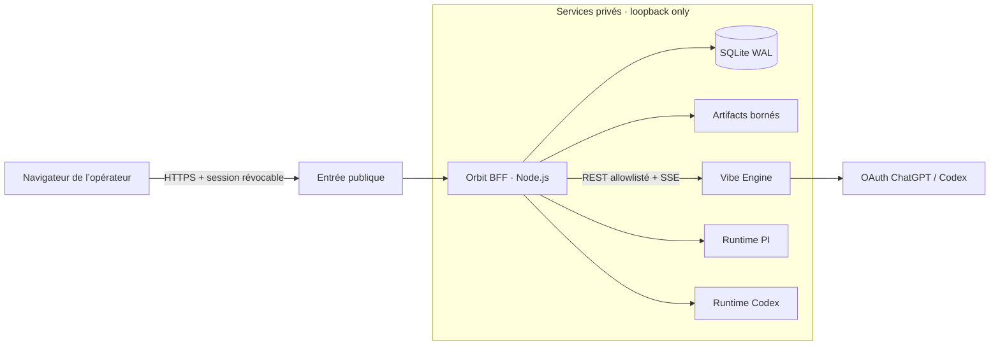

<div align="center">

# Orbit Trading Agent OS

**Un cockpit privé pour concevoir, lancer et observer des équipes d’agents de recherche quantitative.**

[](https://nodejs.org/)
[](https://react.dev/)
[](https://www.typescriptlang.org/)
[](https://sqlite.org/)
[](#roadmap)

[Vision](#vision) · [Fonctionnalités](#fonctionnalités-disponibles) · [Architecture](#architecture) · [Démarrage](#démarrage-local) · [Roadmap](#roadmap) · [Documentation](#documentation)

</div>

> [!IMPORTANT]
> Orbit est actuellement un produit **mono-utilisateur** et **paper-first**. Le trading live, les connexions broker et toute prise de risque financière sont hors du périmètre livré.

## Vision

Orbit transforme un objectif de trading exprimé en langage naturel en travail agentique persistant, observable et reproductible. Le dashboard réunit les conversations, les jobs, les événements, les décisions, les artifacts et la santé du système derrière une seule frontière web authentifiée.

Le projet suit trois principes simples :

- **réel ou explicitement indisponible** — aucune métrique métier fictive en production ;
- **autonomie bornée** — permissions, budgets et limites sont portés par le code et les données ;
- **traçabilité par défaut** — les actions importantes survivent au navigateur et restent auditables.

## Fonctionnalités disponibles

### Control plane Orbit

- session navigateur révocable et contrôle d’origine ;
- conversations PI et Codex persistées dans SQLite ;
- modèle durable `Job / Event / Decision / Audit` ;
- migrations versionnées, sauvegarde cohérente et reprise des jobs stale ;
- liveness, readiness et vue système fondées sur l’état réel ;
- exposition publique unique, services internes limités au loopback.

### Cockpit Vibe réel

- moteur [vibe-trading](https://github.com/virattt/vibe-trading) épinglé et isolé par service systemd ;
- OAuth ChatGPT/Codex via le provider `openai-codex`, sans clé API dans le navigateur ;
- sessions, messages et historique persistants ;
- événements temps réel relayés en SSE avec reprise par `Last-Event-ID` ;
- catalogue réel de **87 skills** et **30 presets** sur la révision validée ;
- uploads et artifacts exposés uniquement par des contrats allowlistés ;
- annulation, reconnexion et erreurs expurgées.

### Interface

- cockpit spatial React/Vite utilisable sur desktop et tablette ;
- Vibe, conversations, activité, usage, système et observabilité ;
- états vides, chargement, indisponibilité et reconnexion honnêtes ;
- respect de `prefers-reduced-motion` et navigation clavier.

## Architecture



Orbit est l’unique frontière publique. Le navigateur ne reçoit ni credential provider, ni clé interne Vibe, ni chemin absolu du serveur. Le proxy Vibe n’est pas générique : chaque route, méthode et type de contenu est explicitement autorisé.

## Stack

| Couche | Technologie | Responsabilité |
|---|---|---|
| Interface | React 19, TypeScript, Vite | cockpit et vues opérationnelles |
| BFF | Node.js 22 | auth, API Orbit, proxy Vibe, SSE |
| Control plane | SQLite en mode WAL | sessions, jobs, événements, décisions, audit |
| Moteur agents | vibe-trading | conversations, skills, presets et artifacts |
| Exploitation | systemd, Caddy, ngrok | isolation, restart et accès privé |
| Tests | `node:test` | contrats, intégration, sécurité et persistance |

## Démarrage local

### Prérequis

- Node.js 22 ;
- npm ;
- un token d’accès Orbit pour exécuter le serveur ;
- Vibe uniquement si vous souhaitez tester le cockpit agentique réel.

```bash
git clone https://github.com/Grimxjoke/agentic-os.git
cd agentic-os
npm ci
```

Créez ensuite votre configuration locale hors Git :

```bash
export ORBIT_ACCESS_TOKEN="votre-token-local"
export ORBIT_HOST="127.0.0.1"
export ORBIT_PORT="8787"
npm run dev
```

L’interface est servie sous `/orbit/`. Les données locales sont créées par défaut dans `.orbit-data/`, un répertoire ignoré par Git.

> [!CAUTION]
> Ne publiez jamais de token Orbit, de credential OAuth, de clé Vibe ou de fichier issu de `/etc/orbit-os`, `/etc/vibe-trading` ou des répertoires de données privés.

## Commandes utiles

```bash
npm run build          # compilation TypeScript + bundle Vite
npm test               # build puis suite unitaire/intégration
npm run db:migrate     # migrations SQLite
npm run db:backup      # sauvegarde cohérente de la base
npm run check:health   # probes de santé configurées
npm start              # serveur de production
```

## Validation actuelle

La Phase 2 a été validée le **17 juillet 2026** avec :

- **26 tests Orbit** et **92 tests Vibe ciblés** réussis ;
- un smoke test LLM réel via Orbit ;
- la persistance d’une session après restart ;
- le flux SSE complet relayé par le BFF ;
- les probes internes et publiques au vert ;
- un scan du code, du diff, des logs et de l’historique Git sans secret détecté.

## Roadmap

| Phase | Statut | Résultat |
|---|---|---|
| 0 · Baseline et réseau | ✅ Validée | exposition réduite, auth et restart éprouvés |
| 1 · Control plane persistant | ✅ Validée | SQLite, migrations, jobs, audit et sauvegardes |
| 2 · Vibe réel | ✅ Validée | moteur privé, OAuth, sessions, SSE et artifacts |
| 3 · Agent Lab & Runs | 🚧 En cours | agents versionnés, équipes DAG et runs observables |
| 4 · Files, Memory, Knowledge | ⏳ Planifiée | fichiers bornés, provenance et graphe dérivé |
| 5 · Strategy Factory | ⏳ Planifiée | backtests reproductibles et validations statistiques |
| 6 · Experiment Studio | ⏳ Planifiée | générations, candidats et champion/challenger |
| 7 · Paper Trading | ⏳ Planifiée | sandbox broker, ordres et réconciliation |
| 8 · Hardening & Live Readiness | ⏳ Planifiée | reprise, rétention, sécurité et validation du mandat |

La roadmap détaillée et les critères de sortie se trouvent dans le [plan d’implémentation](docs/IMPLEMENTATION_PLAN.md).

## Structure du dépôt

```text
agentic-os/
├── src/                 # interface React et client API
├── server/              # BFF, auth, stockage, policies et proxy Vibe
│   └── migrations/      # migrations SQLite forward-only
├── test/                # tests unitaires et d’intégration
├── deploy/              # unités systemd et configuration d’exploitation
├── scripts/             # migrations, backups et healthchecks
└── docs/                # PRD, plans, runbooks et architecture
```

## Sécurité et limites

- aucun service métier interne ne doit écouter sur une interface publique ;
- aucun secret ne doit entrer dans Git, le frontend, les réponses JSON ou les logs ;
- les actions sensibles passent par une policy explicite et un audit append-only ;
- les écritures et uploads sont bornés par contrat ;
- aucun live trading n’est activé ou implicitement autorisé ;
- un état non vérifiable est présenté comme indisponible, jamais comme réussi.

Pour signaler une vulnérabilité, évitez une issue publique contenant des détails exploitables ou des secrets. Utilisez le canal privé du propriétaire du dépôt.

## Documentation

- [PRD produit](docs/PRD.md)
- [Carte d’architecture](docs/ARCHITECTURE_MAP.md)
- [Plan d’implémentation](docs/IMPLEMENTATION_PLAN.md)
- [PRD Phase 2](docs/PHASE_2_PRD.md)
- [Runbook Phase 2](docs/PHASE_2_RUNBOOK.md)
- [PRD Phase 3](docs/PHASE_3_PRD.md)
- [Plan Phase 3](docs/PHASE_3_PLAN.md)
- [Runbook Phase 0](docs/PHASE_0_RUNBOOK.md)

## Contribution

Le projet est développé par tranches verticales démontrables. Une tranche n’est considérée terminée qu’avec ses tests, sa migration éventuelle, son observabilité et son chemin de rollback. Les commits doivent rester petits, intentionnels et réversibles.

---

<div align="center">
  <strong>Orbit</strong> — rendre le travail agentique observable avant de le rendre autonome.
</div>
