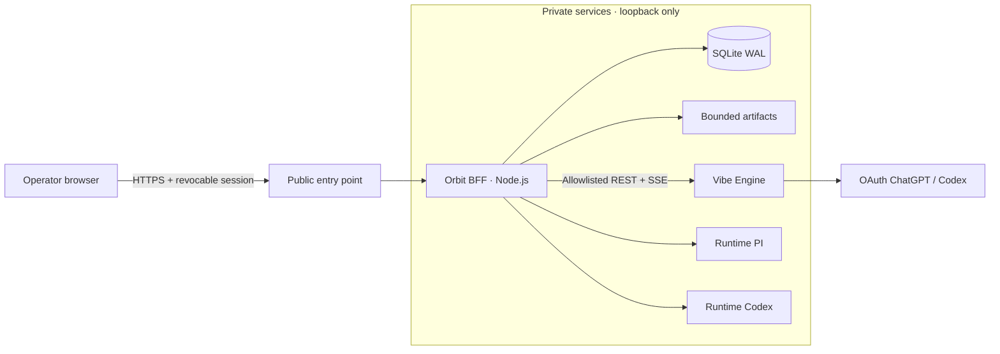

<div align="center">

# Orbit Trading Agent OS

**A private cockpit to design, launch and observe teams of quantitative research agents.**

[](https://nodejs.org/)
[](https://react.dev/)
[](https://www.typescriptlang.org/)
[](https://sqlite.org/)
[](#roadmap)

[Vision](#vision) · [Features](#available-features) · [Architecture](#architecture) · [Startup](#local-boot) · [Roadmap](#roadmap) · [Documentation](#documentation)

</div>

> [!IMPORTANT]
> Orbit is currently a **single-user** and **paper-first** product. Live trading, broker connections and any financial risk taking are outside the scope delivered.

## Vision

Orbit transforms a trading objective expressed in natural language into persistent, observable and repeatable agentic work. The dashboard brings together conversations, jobs, events, decisions, artifacts and system health behind a single authenticated web border.

The project follows three simple principles:

- **real or explicitly unavailable** — no fictitious business metrics in production;
- **bounded autonomy** — permissions, budgets and limits are carried by code and data;
- **traceability by default** — important actions survive the browser and remain auditable.

## Available features

### Control plane Orbit

- revocable browser session and origin control;
- PI and Codex conversations persisted in SQLite;
- durable model `Job / Event / Decision / Audit`;
- versioned migrations, consistent backup and recovery of stale jobs;
- liveness, readiness and system view based on the actual state;
- a single public entry point, with internal services restricted to loopback.

### Real Cockpit Vibe

- [Vibe-Trading](https://github.com/HKUDS/Vibe-Trading) engine pinned and isolated by a systemd service;
- OAuth ChatGPT/Codex via the `openai-codex` provider, without API key in the browser;
- persistent sessions, messages and history;
- real-time events relayed in SSE with recovery by `Last-Event-ID`;
- real catalog of **87 skills** and **30 presets** on the validated revision;
- uploads and artifacts exposed only by allowlisted contracts;
- cancellation, reconnection, and redacted errors.

### Agent Lab and Runs

- versioned agents and teams with immutable history;
- DAG editor, cycle validation, and concurrency limited to two workers;
- exact snapshots of executed definitions;
- durable Vibe orchestration with cancellation, retry, and restart recovery;
- resumable SSE timeline, provider-reported usage, and referenced artifacts;
- Observatory and Activity powered by real persistent data.

### Files, artifacts, memory, and knowledge

- allowlisted filesystem browser with traversal and symlink protection;
- atomic text editing, optimistic conflict detection, and restorable backups;
- unified index for workspace files and durable run artifacts;
- persistent memory with explicit confidence, kind, and provenance;
- hypothesis register with evidence statuses and source links;
- read-only knowledge graph derived from canonical agents, teams, runs, files, hypotheses, and memories.

### Interface

- React/Vite space cockpit usable on desktop and tablet;
- Vibe, conversations, activity, usage, system and observability;
- honest empty states, loading, unavailability and reconnection;
- respect for `prefers-reduced-motion` and keyboard navigation.

## Architecture



Orbit is the only public border. The browser receives neither credential provider, nor Vibe internal key, nor absolute path from the server. The Vibe proxy is not generic: every route, method, and content type is explicitly allowed.

## Stack

| Layer | Technology | Responsibility |
|---|---|---|
| Interface | React 19, TypeScript, Vite | cockpit and operational views |
| BFF | Node.js 22 | auth, API Orbit, proxy Vibe, SSE |
| Control plane | SQLite in WAL mode | sessions, jobs, events, decisions, audit |
| Agent engine | vibe-trading | conversations, skills, presets, and artifacts |
| Operations | systemd, Caddy, ngrok | isolation, restart, and private access |
| Tests | `node:test` | contracts, integration, security and persistence |

## Local boot

### Prerequisites

- Node.js 22;
- npm;
- an Orbit access token to run the server;
- Vibe only if you want to test the real agentic cockpit.

```bash
git clone https://github.com/Grimxjoke/Orbit-Trading-Agent-OS.git
cd Orbit-Trading-Agent-OS
npm ci
```

Then create your local configuration outside Git:

```bash
export ORBIT_ACCESS_TOKEN="your-local-token"
export ORBIT_HOST="127.0.0.1"
export ORBIT_PORT="8787"
npm run dev
```

The interface is served as `/orbit/`. Local data is created by default in `.orbit-data/`, a directory ignored by Git.

> [!CAUTION]
> Never publish an Orbit token, OAuth credential, Vibe key or file from `/etc/orbit-os`, `/etc/vibe-trading` or private data directories.

## Useful commands

```bash
npm run build          # TypeScript compilation + Vite bundle
npm test               # build, then unit/integration suite
npm run db:migrate     # SQLite migrations
npm run db:backup      # consistent database backup
npm run check:health   # configured health probes
npm start              # production server
```

## Current validation

Phase 2 was validated on **July 17, 2026** with:

- **26 Orbit tests** and **92 targeted Vibe tests** passed;
- a real LLM smoke test via Orbit;
- the persistence of a session after restart;
- the complete SSE flow relayed by the BFF;
- internal and public probes are green;
- a scan of the code, diff, logs and Git history with no secrets detected.

Phase 3 adds a successful build and **37 Orbit tests** including DAG,
concurrency, budgets, policies, cancellation, retry, recovery, SSE, and Vibe orchestration.

Phase 4 raises the suite to **43 Orbit tests**, adding traversal, symlink, extension,
size, binary, atomic write, conflict, backup restoration, index refresh, search,
provenance, and broken-link coverage.

## Roadmap

| Phase | Status | Result |
|---|---|---|
| 0 · Baseline and network | ✅ Validated | reduced exposure, proven auth and restart |
| 1 · Control plane persistent | ✅ Validated | SQLite, migrations, jobs, audit and backups |
| 2 · Real Vibe | ✅ Validated | private engine, OAuth, sessions, SSE and artifacts |
| 3 · Agent Lab & Runs | ✅ Validated | versioned agents, DAG teams and observable runs |
| 4 · Files, Memory, Knowledge | ✅ Implemented | bounded files, restorable backups, provenance and derived graph |
| 5 · Strategy Factory | ⏳ Planned | reproducible backtests and statistical validations |
| 6 · Experiment Studio | ⏳ Planned | generations, candidates and champion/challenger |
| 7 · Automations & Human Inbox | ⏳ Planned | durable workflows, schedules and bounded decisions |
| 8 · Paper Trading | ⏳ Planned | sandbox broker, orders and reconciliation |
| 9 · Limited Live Trading | ⏳ Gated | expiring mandates, reconciliation and kill switches |
| 10 · Design consolidation | ⏳ Planned | responsive layout, real event motion and accessibility audit |

The detailed roadmap and exit criteria can be found in the [implementation plan](docs/IMPLEMENTATION_PLAN.md).

## Repository structure

```text
Orbit-Trading-Agent-OS/
├── src/                 # React interface and API client
├── server/              # BFF, auth, storage, policies, and Vibe proxy
│   └── migrations/      # migrations SQLite forward-only
├── test/                # unit and integration tests
├── deploy/              # systemd units and operations configuration
├── scripts/             # migrations, backups, and health checks
└── docs/                # PRD, plans, runbooks, and architecture
```

## Safety and limits

- no internal business service should listen on a public interface;
- no secrets should enter Git, the frontend, JSON responses or logs;
- sensitive actions go through an explicit policy and an append-only audit;
- writings and uploads are limited by contract;
- no live trading is activated or implicitly authorized;
- an unverifiable state is presented as unavailable, never as successful.

To report a vulnerability, avoid a public issue containing exploitable details or secrets. Use the repository owner's private channel.

## Documentation

- [Product PRD](docs/PRD.md)
- [Architecture map](docs/ARCHITECTURE_MAP.md)
- [Implementation plan](docs/IMPLEMENTATION_PLAN.md)
- [PRD Phase 2](docs/PHASE_2_PRD.md)
- [Runbook Phase 2](docs/PHASE_2_RUNBOOK.md)
- [PRD Phase 3](docs/PHASE_3_PRD.md)
- [Plan Phase 3](docs/PHASE_3_PLAN.md)
- [Plan Phase 4](docs/PHASE_4_PLAN.md)
- [Runbook Phase 4](docs/PHASE_4_RUNBOOK.md)
- [Phase 4 human acceptance test](docs/PHASE_4_HUMAN_TEST.md)
- [Runbook Phase 3](docs/PHASE_3_RUNBOOK.md)
- [Phase 3 human acceptance test](docs/PHASE_3_HUMAN_TEST.md)
- [Runbook Phase 0](docs/PHASE_0_RUNBOOK.md)

## Contribution

The project is developed in demonstrable vertical sections. A slice is only considered finished with its tests, its possible migration, its observability and its rollback path. Commits should be kept small, intentional, and reversible.

---

<div align="center">
<strong>Orbit</strong> — making agentic work observable before making it autonomous.
</div>
